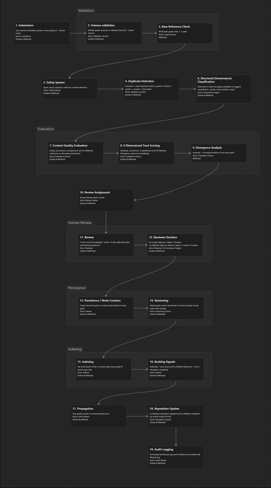

# BLUE Knowledge Review Engine (Prototype)
> A Rust-based prototype for a governed knowledge evolution system.

Instead of treating knowledge as static content (like a wiki), BLUE models it as something that is: submitted, reviewed, classified, and evolved over time.

## Core Idea

Knowledge is not stored - it is processed through a structured lifecycle:
- Submitted by users
- Validated and classified
- Reviewed by humans
- Evolved into variants or amendments
- Tracked through trust and history

The system is designed for auditable knowledge governance, not free-form editing.

## Prototyle Goal
BKR Engine explores how:
- Knowledge evolves through structured submission, classification, and review.
- Every piece of information passes through a governed lifecycle, not direct publication.

The main aim of this prototype is to answer the following question:
- Can a structured review system reliably transform raw user-submitted knowledge into a trustworthy, well-classified, and evolvable knowledge graph while correctly handling safety, quality, and human disagreement?

## Build Philosophy
The engine is built in layers, starting simple and becoming more intelligent over time.

This project follows a strict progression:
- Structure first
- Governance before intelligence
- Deterministic logic before ML

The goal is to ensure the system work.

## System Maturity Phases

The BLUE Knowledge Review Engine is built as a progressive decision system, where each phase increases the system's ability to evaluate, classify, and govern knowledge.

These phases describe maturity of decision-making capability, not just feature completion.

### Phase 1 - Pipeline Foundation (Structural Engine)
This phase establishes the core deterministic pipeline that everything else builds on.

**Goal:** Create a fully working ingestion --> processing --> output pipeline with no intelligence.

#### What exists in this phase:
- Domain models (Submission, Guide, Review, TrustVector)
- Markdown ingestion --> Submission creation
- Workflow pipeline execution order
- State machine for submission lifecycle
- Basic heuristic scoring (quality + trust)
- Basic governance classification (rule-based decisions)

#### Characteristics:
- Fully deterministic logic
- No embeddings or ML
- No human involvement
- No persistent storage required yet (prototype mode)

#### Output:
Structured processing pipeline that can take raw Markdown and produce a classified decision.

### Phase 2 - Deterministic Intelligence Layer
This phase introduces structured reasoning and decision weighting, without probabilistic or ML systems.

**Goal:** Make system outputs explainable and rule-driven, where scoring influences decisions.

#### What is introduced:
- Governance rules refined into structured classification logic
- Trust scoring influences decision outcomes
- Quality scoring becomes a decision signal, not just a metric
- Duplicate detection (exact + semantic heuristics)
- Divergence analysis (method vs base guide comparison)

#### Characteristics:
- Still deterministic
- Rules > heuristics
- Scores begin influencing classification decisions
- Decisions become explainable and traceable

### Phase 3 - Human-in-the-Loop Review System
This phase introduces structured human governance into the pipeline.

**Goal:** Add human validation and escalation where system confidence is insufficient.

#### What is introduced:
- Reviewer assignment system
- Review queues and workflows
- Approval / rejection / escalation flow
- Consensus handling for conflicting reviews
- Audit tracking of reviewer decisions

#### Characteristics:
- Hybrid human + system decision-making
- System provides recommendations, not final authority in all cases
- Governance becomes operational, not just analytical

### Phase 4 - Knowledge Graph & Retrieval Layer
This phase turns processed submissions into a navigable knowledge structure.

**Goal:** Enable discovery, linking, and traversal of knowledge.

#### What is introduced:
- Relationship graph between guides, variants, and amendments
- Indexing layer for fast retrieval
- Structured search (non-ML initially)
- Hierarchical knowledge organisation
- Versioning and lineage tracking

#### Characteristics:
- Focus on structure of knowledge, not just evaluation
- Enables navigation across related concepts
- Builds foundation for semantic search later

### Phase 5 - Probabilistic Intelligence Layer
This phase introduces ML and probabilistic reasoning into the system.

**Goal:** Enhance decision-making using learned patterns and embeddings.

#### What is introduced:
- Embedding-based semantic similarity
- ML-powered duplicate detection
- Trust prediction models
- Reviewer recommendation systems
- Abuse / anomaly detection models
- Adaptive scoring refinement

#### Characteristics:
- Non-deterministic augmentation layer
- Improves system accuracy over time
- Does not replace governance rules, only enhances them

## Key Design Principle
At all phases:
> Deterministic governance remains the system's foundation.  
> Intelligence layers augment, not replace, structural decision logic.

## The Complete Review Process
